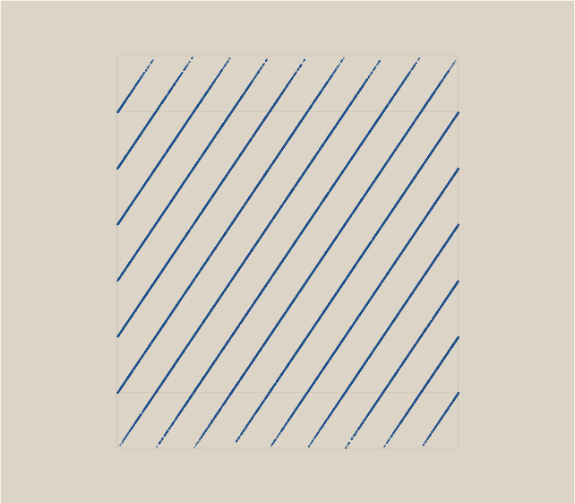

# Würfel

Ein Prüfstand für Zufallsgeneratoren. Chi-Quadrat, serielle Korrelation, Gitterfüllung,
Periodensuche — und ein drehbarer Würfel, in dem schlechte Generatoren als **Ebenen**
sichtbar werden.

### → [Öffnen](https://ssims437.github.io/wuerfel/)

Eine einzelne HTML-Datei. Kein Build, keine Bibliothek, alles im Browser gerechnet.

---

## Das Bild, um das es geht

**RANDU** war jahrzehntelang auf IBM-Großrechnern in Gebrauch. Es besteht jeden einfachen
Test: Chi-Quadrat 253 bei einem Sollwert von 255, Korrelation −0,006, Flächenbild zu
100 % gefüllt. Makellos.

Im Raum ist es **nichts als 15 Linien**:



Jeder der 30 000 Punkte liegt auf einer davon. Der Grund ist eine simple Rekursion:
`x₍ₙ₊₂₎ = 6·x₍ₙ₊₁₎ − 9·xₙ` — also liegt jedes Tripel auf `9x − 6y + z = k·2³¹`. Nachgerechnet
über 20 000 Werte: exakt **15 verschiedene** Ebenen-Indizes, kein einziger Rest ungleich null.

Den Blickwinkel findet von Hand niemand, deshalb gibt es dafür einen Knopf. Die
Bedingung ist, dass die **Normale in der Bildebene liegt** — nicht in der Tiefe. Wer sie
in die Tiefe dreht, schaut die Ebenen von vorn an und sieht eine volle Fläche. Genau
diesen Fehler habe ich beim Bauen zuerst gemacht.

## Mein eigener Fehler als Ausstellungsstück

Der Eintrag „LCG, kaputt" ist kein Strohmann, sondern ein Fehler, den ich in derselben
Woche **zweimal ausgeliefert** habe:

```js
seed = (seed * 1103515245 + 12345) & 0x7fffffff;   // falsch
seed = (Math.imul(seed, 1103515245) + 12345) & 0x7fffffff;   // richtig
```

Bei `seed` in der Größenordnung 2³¹ liegt das Produkt jenseits von 2⁵³. JavaScript
rundet, und ausgerechnet die unteren Bits — die man mit der Maske behält — sind der
gerundete Rest. Gemessen:

| Generator | Chi² (Soll 255 ± 23) | Würfel gefüllt (Soll 98,7 %) |
|---|---|---|
| mulberry32 | 261 | 98,6 % |
| Math.random | 267 | 98,6 % |
| LCG, exakt gerechnet | 256 | 98,7 % |
| **LCG, kaputt (meiner)** | **1347** | **69,4 %** |
| RANDU | 253 | **58,9 %** |
| Zähler (kein Zufall) | 28 | 0,5 % |

Im Bit-Diagramm sieht man den Schaden direkt: die untersten sieben Bit sind völlig
unausgewogen.

## Zwei Fallen im Prüfstand selbst

Beides ist mir beim Bauen passiert und beides würde stillschweigend falsche Urteile
erzeugen:

- **Skalierung statt Generator gemessen.** Einen 31-Bit-Generator auf 32 Bit
  hochzuschieben macht das unterste Bit konstant null — der Bit-Test schlägt an und
  beschuldigt den Generator für etwas, das der Prüfstand selbst verursacht hat. Jeder
  Generator nennt jetzt seine Breite, und getestet werden nur seine eigenen Bits.
- **Feste Schwelle für die Gitterfüllung.** Auch echter Zufall füllt ein Gitter nicht
  vollständig: bei *n* Würfen auf *z* Zellen sind im Mittel `1 − (1 − 1/z)ⁿ` besetzt, bei
  60 000 Punkten auf 24³ Zellen also 98,7 % und nicht 100 %. Eine feste Schwelle wäre bei
  kleinerer Stichprobe eine Falle für gute Generatoren. Der Sollwert wird jetzt
  mitgerechnet und mit angezeigt.

## Was diese Tests nicht leisten

Sie finden grobe Schnitzer, nicht Schwäche gegen einen Angreifer. Ein Generator kann
alles hier bestehen und trotzdem vollständig **vorhersagbar** sein — mulberry32 etwa ist
gut für Simulationen und völlig ungeeignet für Schlüssel oder Token. Dafür gibt es
`crypto.getRandomValues`, und dafür braucht es andere Prüfungen.

## Lizenz

[MIT](LICENSE)

Verwandt: [Plotterblätter](https://github.com/ssims437/plotterblaetter) ·
[Redundanz](https://github.com/ssims437/redundanz) ·
[Reparatur](https://github.com/ssims437/reparatur) ·
[Rechenwerk](https://github.com/ssims437/rechenwerk) ·
[Nachkomma](https://github.com/ssims437/nachkomma) ·
[Zeitsprung](https://github.com/ssims437/zeitsprung)
